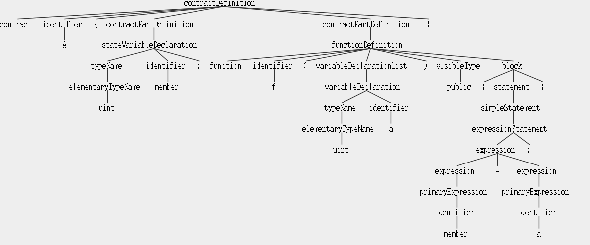

# Slither 源码分析


## Slither 整体架构
```
├── build
│   ├── bdist.linux-x86_64
│   └── lib
├── dist
├── examples    API使用的示例代码
│   ├── printers
│   └── scripts
├── plugin_example  插件示例代码
│   └── slither_my_plugin
├── scripts
├── slither            
│   ├── analyses         分析代码，污点分析
│   ├── core             核心解析AST
│   ├── detectors        漏洞检测
│   ├── printers         结果输出
│   ├── __pycache__
│   ├── slithir          IR
│   ├── solc_parsing     内容和core目录对接，core是接口，该目录是对solc AST规则的实现
│   ├── utils
│   └── visitors         
├── slither_analyzer.egg-info
└── tests
    └── expected_json
```


分析solc生成的ast-json， 生成IR，然后进行漏洞检测

```json
{
    "attributes":{}
    "children":[]
    "id":1
    "name":"PragmaDirective"
    "src":"src offset: length : file idx"

}
```

## solc的AST

先来看solidity grammer, 见grammar.txt 
```
FunctionDefinition = 'function' Identifier? ParameterList( ModifierInvocation | StateMutability | 'external' | 'public' | 'internal' | 'private' )* ( 'returns' ParameterList )? ( ';' | Block )

Block = '{' Statement* '}'
Statement = IfStatement | WhileStatement | ForStatement | Block | InlineAssemblyStatement |
            ( DoWhileStatement | PlaceholderStatement | Continue | Break | Return | Throw | EmitStatement | SimpleStatement ) ';'

SimpleStatement = VariableDefinition | ExpressionStatement

Expression
  = Expression ('++' | '--')
  | NewExpression
  | IndexAccess
  | MemberAccess
  | FunctionCall
  | '(' Expression ')'
  | ('!' | '~' | 'delete' | '++' | '--' | '+' | '-') Expression
  | Expression '**' Expression
  ...
  | PrimaryExpression

PrimaryExpression = BooleanLiteral
                  | NumberLiteral
                  | HexLiteral
                  | StringLiteral
```

函数的属性包括了是否是constant，是否是constructor，是否payable，函数名，可见性.
function的第一个child是ParameterList, 第二个child也叫ParameterList但其实表示返回值, 可见性、修饰符等声明，然后就是block,有多个statement组成，statement又由expression组成...


```solidity
contract A {
    uint member;
    function f(uint a) public{
        member = a;
    }
}
```
## slither分析流程

slither目录下的__main__.py， 解析参数确定要加载的detector和printer,和测试的solidity文件名，创建Slither对象。 在slither.py中,__init__函数调用solc生成ast-json, 进行了parse_contract_from_json 和 analyze_contract

### parse:
源码分为几个部分，'PragmaDirective', 'ImportDirective'，'ContractDefinition'  分别是编译器指示选项，import, 和合约定义。


### analyze:
先确定继承关系，区分libray和正常合约, analyze分了三个part，
* 第一个part是struct/variable/function/contract, 
* 第二个part是struct/event
* 第三个part是variable/modifier/function
  分析完了之后convert_to_slithir

#### analyze_first_part
 从基类开始，确保在分析一个合约之前所有的父类都分析完了.contract.parse_functions()  slither/solc_parsing/declarations/contract.py 构造 slither/solc_parsing/declarations/function.py 中的funtcionSolc


#### analyze_third_part
```
contract.analyze_content_functions 
     function.analyze_content()
        parse_cfg
        node.analyze_expressions
```

### convert_to_slitherir
```
    function.convert_expression_to_slithir
      node.slithir_generation
        convert_expression(expression, node)
```

TBC
